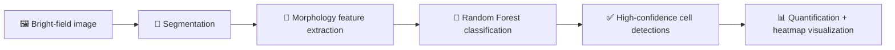

# 🔬 BCQA 0.0.2 — Collecting · Training · Running

> **BCQA** is a lightweight **AI-assisted cell morphology analysis tool** for **bright-field microscopy**.
> It supports **cell segmentation, morphology quantification, thickness heatmap visualization, and automated non-cell filtering** using a trained **Random Forest classifier**.

<p align="center">
  
</p>

---

## 🌟 Project Overview

BCQA is designed for **rapid cell quality assessment without fluorescence labeling**.
It focuses on extracting meaningful morphology signals from bright-field images and using a machine-learning filter to improve object quality by removing likely **non-cell artifacts**.

### 💡 In one sentence

```text
Bright-field image → cell segmentation → morphology features → Random Forest filtering → clean quantitative cell analysis
```

---

## 🚀 Key Features

| Category | What BCQA does | Why it matters |
|---|---|---|
| 🧩 **Automatic Cell Segmentation** | Otsu or Adaptive thresholding, morphological cleanup, marker-controlled contour detection | Detects cells from bright-field images with minimal manual work |
| 📏 **Morphology Quantification** | Area, perimeter, circularity, aspect ratio, convex area, equivalent diameter, mean intensity | Converts cell shape and appearance into measurable features |
| 🌫️ **Thickness Heatmap Visualization** | Fills cells with a grayscale map proportional to mean intensity | Provides an intuitive thickness-like visual readout |
| 🌲 **Random Forest Quality Filtering** | Loads a trained `.joblib` model and removes likely non-cell objects or segmentation artifacts | Improves result quality by keeping high-confidence detections |
| 🖥️ **Interactive Streamlit Interface** | User-friendly interface for loading data and inspecting results | Makes the workflow easier to use and iterate |

---

## 🧠 Core Idea

After segmentation, each detected object is represented by a **morphology feature vector**.
That feature vector is then used by a **RandomForestClassifier** to distinguish biologically meaningful cell detections from likely artifacts or undesired objects.

### 🔄 Conceptual pipeline



---

## 🧪 Analysis Components

### 1. 🧩 Automatic Cell Segmentation

BCQA supports multiple segmentation-related operations:

- **Otsu thresholding**
- **Adaptive thresholding**
- **Morphological cleanup**
- **Marker-controlled contour detection**

These steps help transform raw bright-field imagery into candidate object masks for downstream feature analysis.

### 2. 📏 Quantitative Cell Morphology Extraction

For each detected object, BCQA extracts a morphology profile.

| Feature | Meaning |
|---|---|
| **Area** | Size of the detected object |
| **Perimeter** | Boundary length |
| **Circularity** | How round the object is |
| **Aspect ratio** | Shape elongation |
| **Convex area** | Area of the convex hull |
| **Equivalent diameter** | Diameter of an equal-area circle |
| **Mean intensity** | Intensity-derived proxy related to thickness |

---

## 🌫️ Thickness Heatmap Visualization

BCQA includes a grayscale thickness-style display:

- cells are filled using a **greyscale map proportional to mean intensity**
- **brighter cells → thicker → darker grey**

This provides a fast visual summary of image-derived thickness-related variation across segmented objects.

---

## 🌲 Random Forest Quality Filtering

One of the key project ideas is the use of a trained **Random Forest** model to filter detections.

### What it does

- loads a trained `.joblib` model
- classifies segmented objects using morphology features
- removes likely **non-cell objects** or **segmentation artifacts**
- keeps only **high-confidence cell detections**

### Why this matters

Bright-field segmentation often detects undesired structures. A morphology-based classifier adds a second quality-control layer beyond raw thresholding and contour extraction.

---

## 📊 Random Forest Feature Visualization

These panels illustrate training behavior, feature relationships, classification boundaries, and feature importance.

| Training Session Panel | Feature Correlation |
|:--:|:--:|
|  |  |

| Classification Boundary | Model Feature Importance |
|:--:|:--:|
|  |  |

---

## 🧰 What BCQA Produces

Depending on the analysis stage, BCQA is designed to provide:

| Output Type | Description |
|---|---|
| 🧩 Segmentation result | Detected cell/object masks or contours |
| 📏 Morphology measurements | Quantitative feature values for each object |
| 🌫️ Thickness-like heatmap | Mean-intensity-based grayscale visualization |
| 🌲 Filtered detections | Random-Forest-refined set of likely true cells |
| 🖥️ Interactive review | Streamlit-based visual inspection and control |

---

## 🎯 Best-Fit Use Case

BCQA is especially useful when you want to:

- analyze **bright-field microscopy** images
- quantify **cell morphology** without fluorescence labeling
- screen out likely **artifacts** automatically
- build a faster **cell quality assessment** workflow

---

## ✨ Project Highlights

| Highlight | Summary |
|---|---|
| 🔬 Label-free focus | Designed for rapid assessment without fluorescence labeling |
| 🧠 AI-assisted filtering | Uses a trained Random Forest classifier for quality control |
| 📐 Feature-driven pipeline | Converts segmented objects into interpretable morphology vectors |
| 🌫️ Visual output | Includes thickness-like grayscale heatmap visualization |
| 🖥️ Easy interaction | Built around an interactive Streamlit interface |

---

## 🗂️ Suggested README Expansion Later

This refined version preserves the current project information.
If you want to make the repository even stronger later, the next helpful sections would be:

- installation
- environment requirements
- how to run the Streamlit app
- expected input image format
- output file examples
- model training workflow for the Random Forest classifier

---

## 🧾 Short Summary

**BCQA is a bright-field cell morphology analysis tool that combines segmentation, quantitative morphology extraction, thickness-style visualization, and Random Forest-based artifact filtering inside an interactive Streamlit workflow.**
